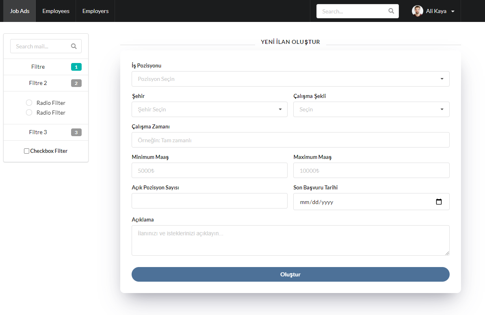
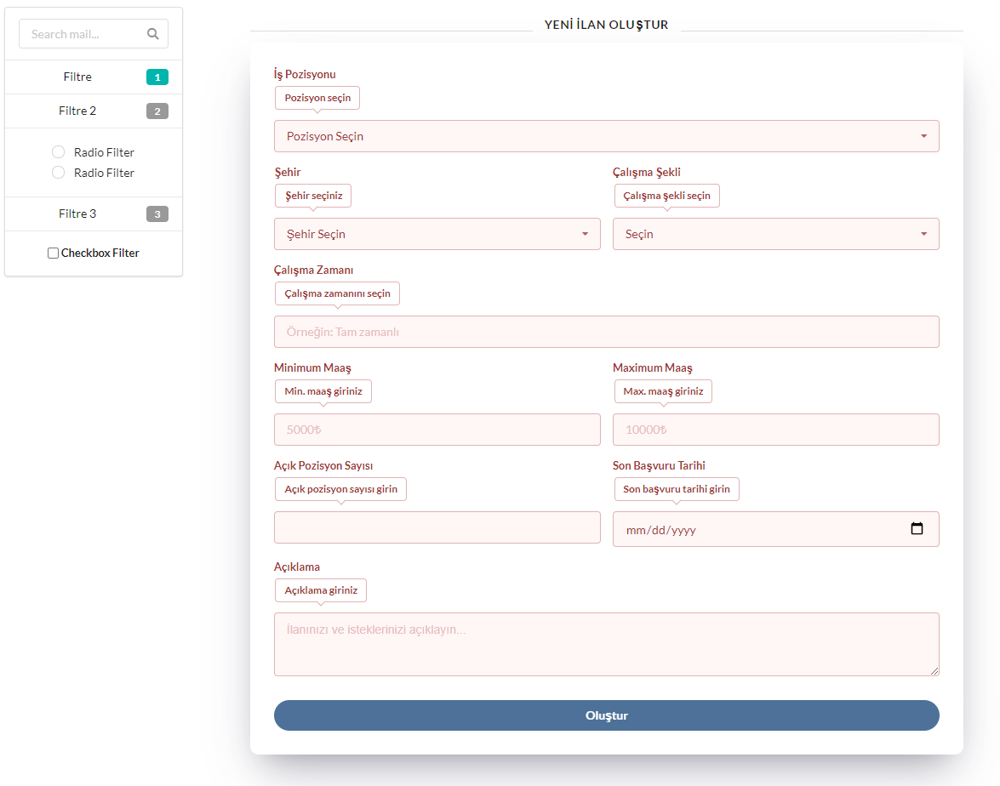
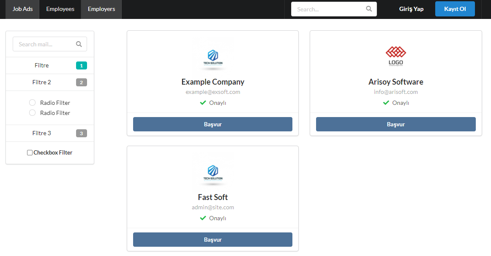
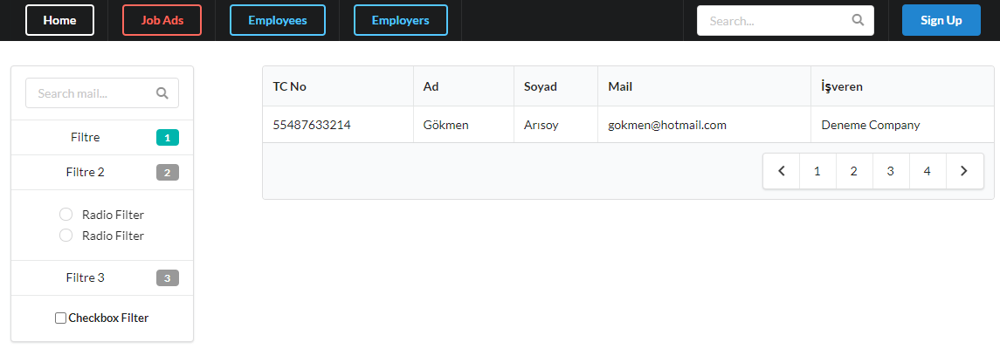
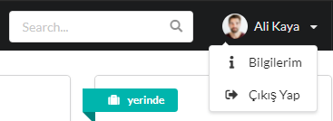
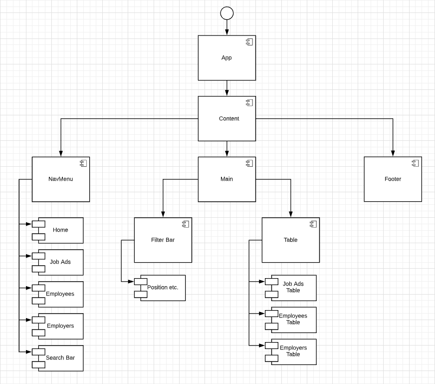

# HRMS-front-end
Engin Demiroğ, Java + React bootcamp HRMS project front-end codes.

[Spring Boot Back-end Project](https://github.com/yusufarisoy/HRMS-back-end)

## In App Screenshots

#### Job-ad Create Form

#### Employers

#### Employees

#### Session

## UML Component Diagram

[ReactJS](https://reactjs.org/)
[Axios](https://www.npmjs.com/package/axios)
[Semantic UI React](https://react.semantic-ui.com/)