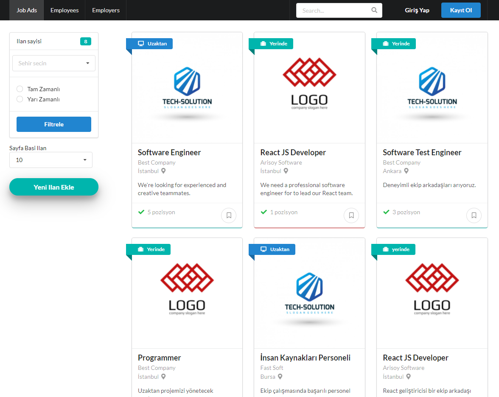
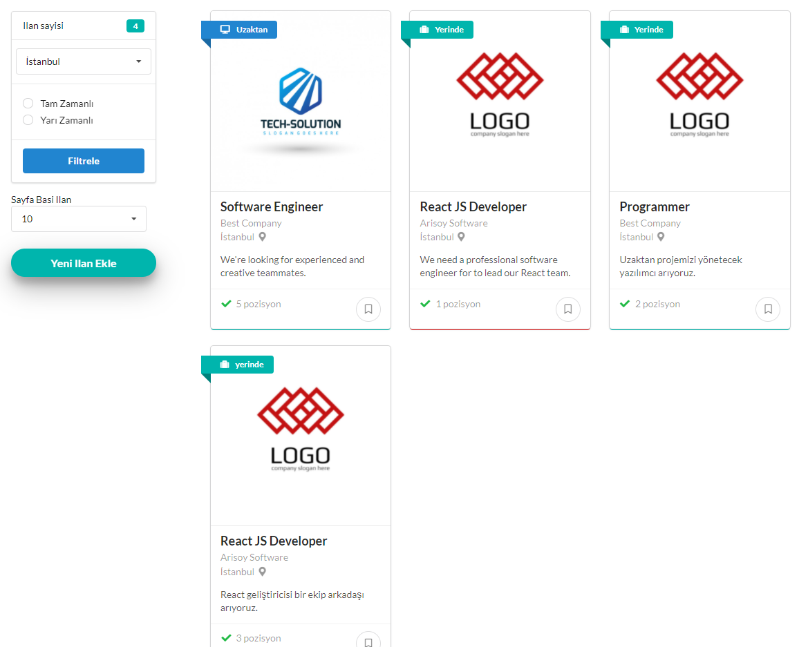
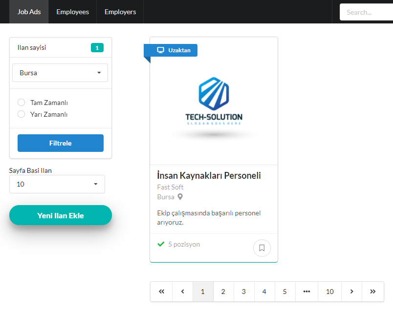
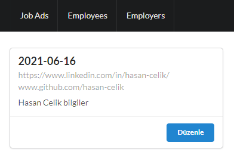
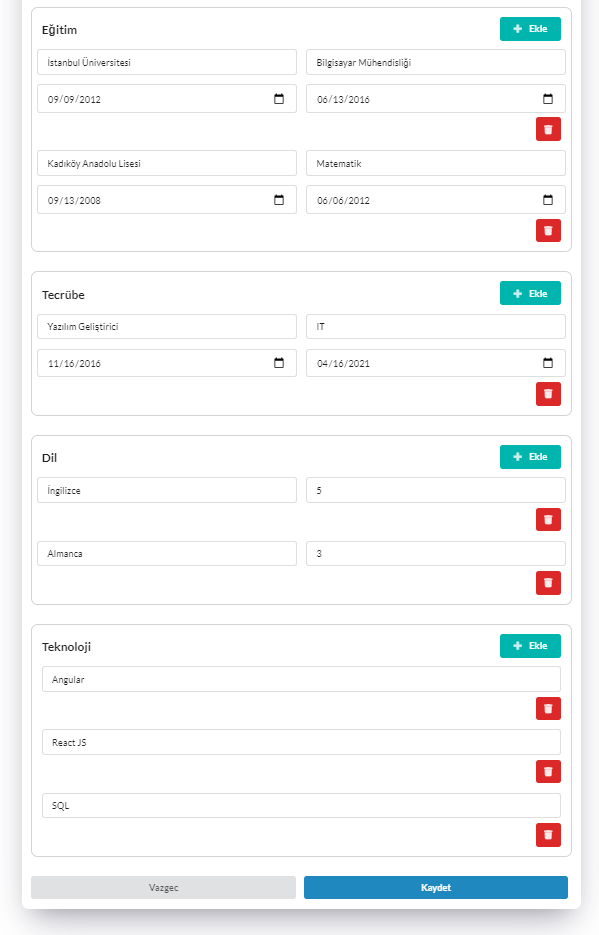
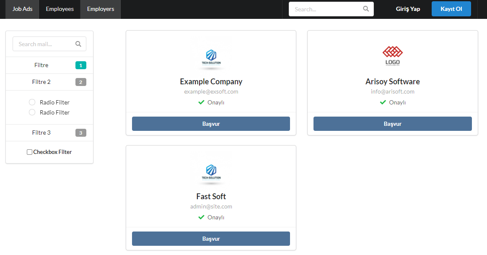
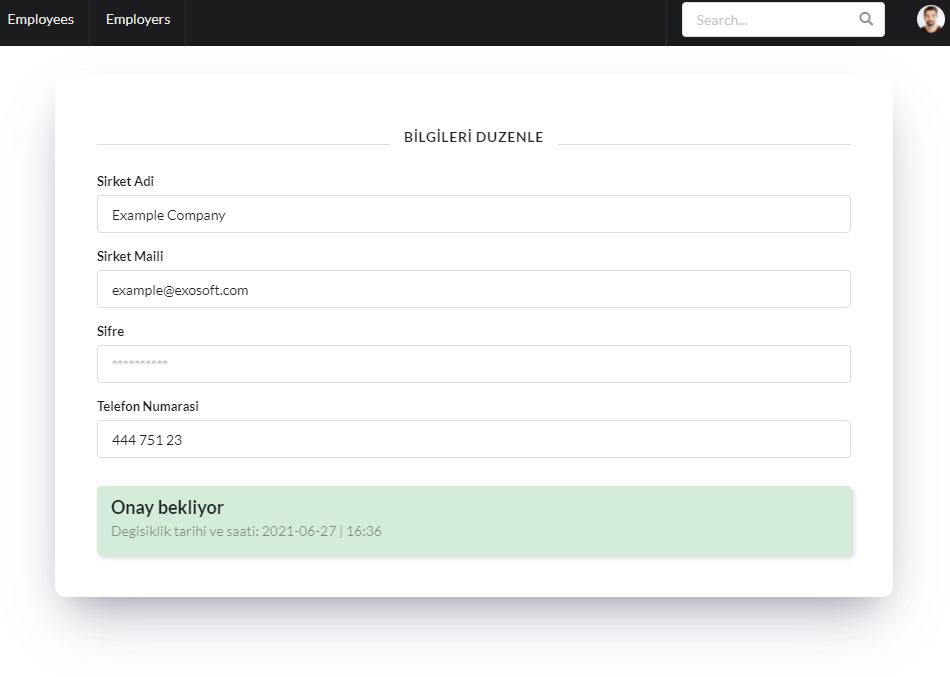
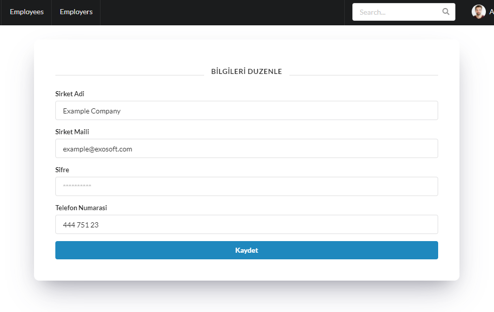
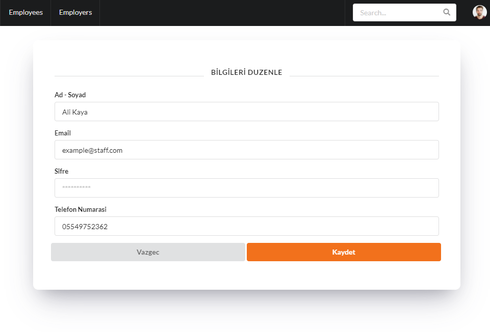
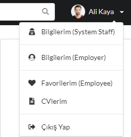

# HRMS-front-end
Engin Demiroğ, Java + React bootcamp HRMS project front-end codes.

[Spring Boot Back-end Project](https://github.com/yusufarisoy/HRMS-back-end)

## Job Advertisements

#### Filters

#### Pagination

## Resumes

#### Edit

## Employers

#### Edit

## System Staff

#### Job-ad Create Form

#### Employees

#### Session and Profile

## UML Component Diagram

#### Technologies
[ReactJS](https://reactjs.org/) [Axios](https://www.npmjs.com/package/axios) [Semantic UI React](https://react.semantic-ui.com/)