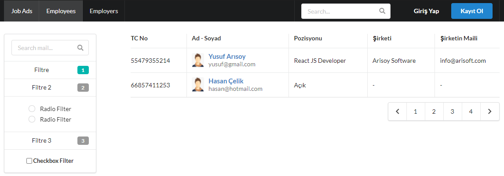

# HRMS-front-end
Engin Demiroğ, Java + React bootcamp HRMS project front-end codes.

[ReactJS](https://reactjs.org/)
[Axios](https://www.npmjs.com/package/axios)
[Semantic UI React](https://react.semantic-ui.com/)

## UML Component Diagram

## In App Screenshots

